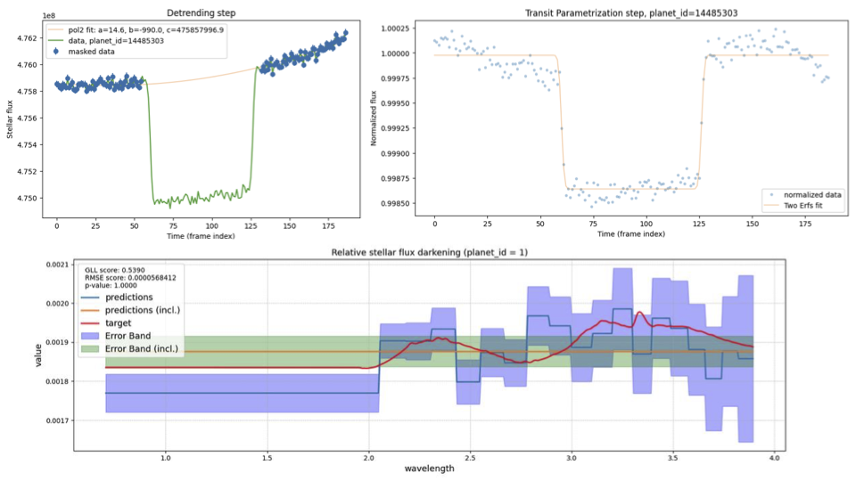

# NeurIPS_ADChallenge2024

Here is the code developped for [NeurIPS - Ariel Data Challenge 2024](https://www.kaggle.com/competitions/ariel-data-challenge-2024/overview) challenge on Kaggle. It contains the 17th place solution based on simple implemetation of parametric fitting for regression of exoplanet's transit deppth. In this repository there are other strategies which were not tested on the competition.

 - Link to the Kaggle submission notebook: [kaggle/parametric-fits-17th-place](https://www.kaggle.com/code/olehkivernyk/parametric-fits-17th-place)

## 1. Calibration procedure
I used the calibration pipeline implemented in C from [this work](https://www.kaggle.com/competitions/ariel-data-challenge-2024/discussion/531453).

## 2. Analysis overview
When I entered this competition, I began with a classical fitting approach for signal reconstruction. Surprisingly, it performed very well compared to other models I tested. This approach has several advantages: it is stable in noisy data, relatively simple to implement, and offers a way to construct reliable confidence intervals.

The method consists of two main steps: data detrending and transit model fitting.

### 2.1 Data detrending
In this step, we identify transit breakpoints, mask the transit phase, and fit a quadratic polynomial to the remaining data. This parametrization provides a model that describes the star’s flux in absence of a planetary transit. The detrended data from this model is used in the next step (see figure).

